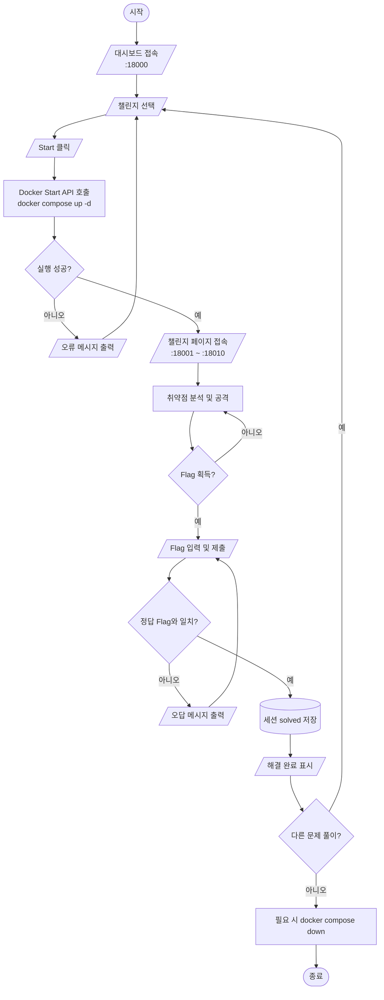

# PortSwigger Top 10 2025 Playground

[한국어 문서 (Korean)](./README-KR.md)


[](https://github.com/Oyeonseok/portiswagger_top10_playground/actions/workflows/build.yml)


A local CTF/wargame playground based on **PortSwigger Top 10 Web Hacking Techniques of 2025**.  
Each challenge is isolated with Docker, and the main dashboard lets you start/stop instances and submit flags.

---

## Overview

This repository is designed for:

- Hands-on practice with modern web exploitation techniques
- Reproducible lab environments for classes, study groups, and team training
- Per-challenge isolation with centralized dashboard control

---

## Demo

현재 외부 배포 URL은 없으며, 로컬 Docker 환경에서 실행합니다.

- Dashboard: `http://localhost:18000`
- Challenge Ports: `18001` ~ `18010`
- Status: 9 Ready / 1 Placeholder

---

## Features

- **Central Dashboard**: 메인 대시보드에서 챌린지 인스턴스를 시작/중지하고 flag를 제출할 수 있습니다.
- **Isolated Challenge Environments**: 각 취약점 실습 환경을 Docker 컨테이너 단위로 분리합니다.
- **PortSwigger Top 10 Mapping**: PortSwigger Top 10 Web Hacking Techniques of 2025 기반 시나리오를 로컬 워게임 형태로 제공합니다.

---

## Requirements

- Docker
- Docker Compose v2 (`docker compose`)
- (Recommended) 8GB+ RAM

---

## Quick Start

```bash
git clone <your-repo-url>
cd portiswagger_top10_playground
docker compose up -d --build
```

Then open:

- **Dashboard**: http://localhost:18000

Play flow:

1. Choose a challenge card
2. Start the instance
3. Exploit and retrieve the flag
4. Submit the flag

---

## Challenge Matrix

| # | Technique | Directory | Access Port | Status |
|---|---|---|---:|---|
| 1 | Successful Errors | `1_successful_errors` | 18001 | ✅ Ready |
| 2 | ORM Leaking | `2_orm_leaking` | 18002 | ✅ Ready |
| 3 | Novel SSRF | `3_novel_ssrf` | 18003 | ✅ Ready |
| 4 | Unicode Normalization | `4_unicode_normalization` | 18004 | ✅ Ready |
| 5 | SOAPwn pwning .NET | `5_soapwn_pwning_NET` | 18005 | 🚧 Placeholder |
| 6 | Cross-site ETag | `6_cross-site_ETag` | 18006 | ✅ Ready |
| 7 | Next.js Cache | `7_Next.js_cache` | 18007 | ✅ Ready |
| 8 | XSS Leak | `8_xss_leak` | 18008 | ✅ Ready |
| 9 | HTTP/2 CONNECT | `9_HTTP2_CONNECT` | 18009 | ✅ Ready |
| 10 | Parser Differentials | `10_parser_differentials/Training-Environment---Parser-Differentials-main` | 18010 | ✅ Ready |

---

## Run Challenges Manually

### Generic

```bash
cd <challenge-directory>
docker compose up -d --build
```
### Normal / Demo Mode

Use this mode for normal play, demo, or presentation.

```bash
docker compose up -d --build
```

### Development Mode

docker compose -f docker-compose.yml -f docker-compose.dev.yml up --build

### Stop

```bash
docker compose down
```

### Challenge #10 Example

```bash
cd 10_parser_differentials/Training-Environment---Parser-Differentials-main
docker compose up -d --build
```

---

## Test

```txt
현재는 로컬 실행 기반 Smoke Test와 Manual Test를 제공하며, 자동화 테스트 커버리지는 아직 제공하지 않습니다.
```

---

## Architecture



---

## Repository Structure

```text
.
├── 0_main_page/                # Main dashboard (Flask)
├── 1_successful_errors/
├── 2_orm_leaking/
├── 3_novel_ssrf/
├── 4_unicode_normalization/
├── 5_soapwn_pwning_NET/        # Placeholder
├── 6_cross-site_ETag/
├── 7_Next.js_cache/
├── 8_xss_leak/
├── 9_HTTP2_CONNECT/
├── 10_parser_differentials/
└── docker-compose.yml           # Dashboard compose
```
---

## Legal / Disclaimer

For **educational and research purposes only**.  
Do not use this project to test unauthorized real-world systems.

---

## Trouble Shooting

| 문제                        | 원인                                  | 해결                                              |
| ------------------------- | ----------------------------------- | ----------------------------------------------- |
| `docker compose` 명령어가 안 됨 | Docker Compose v2 미설치 또는 Docker 미실행 | Docker Desktop 실행 후 `docker compose version` 확인 |
| Dashboard 접속 불가           | `18000` 포트 충돌 또는 컨테이너 미실행           | `docker compose ps`로 상태 확인                      |
| 챌린지 포트 접속 불가              | 해당 챌린지 인스턴스가 아직 시작되지 않음             | 대시보드에서 Start 클릭                                 |
| 빌드가 오래 걸림                 | 여러 챌린지 컨테이너를 동시에 빌드                 | 최초 실행 시 대기, 이후 재실행은 빨라짐                         |
| 메모리 부족                    | 여러 컨테이너 동시 실행                       | 사용하지 않는 챌린지는 Stop 처리                            |

---

## MyContribute

저는 **8번 챌린지인 XSS-Leak 문제 구현**을 담당했습니다.

이 챌린지는 일반적인 XSS처럼 스크립트를 직접 실행해 데이터를 탈취하는 방식이 아니라,  
브라우저의 동작 차이와 응답 차이를 이용해 **교차 출처 환경에서 민감한 정보를 간접적으로 추론하는 공격 흐름**을 실습하도록 설계했습니다.

---

## 선택 이유

XSS-Leak을 선택한 이유는 최신 웹 환경에서 중요한 보안 이슈이기 때문입니다.

Same-Origin Policy는 다른 출처의 응답 내용을 직접 읽는 것을 막지만,  
브라우저의 렌더링 차이, 로딩 성공/실패 여부, 응답 시간, 리소스 크기 차이 등을 통해  
사용자의 로그인 여부나 특정 데이터 존재 여부를 간접적으로 추론할 수 있습니다.

따라서 XSS-Leak은 단순한 입력값 필터링 문제가 아니라,  
브라우저 보안 정책과 사이드 채널 정보 유출을 함께 이해해야 하는 취약점입니다.

--- 


